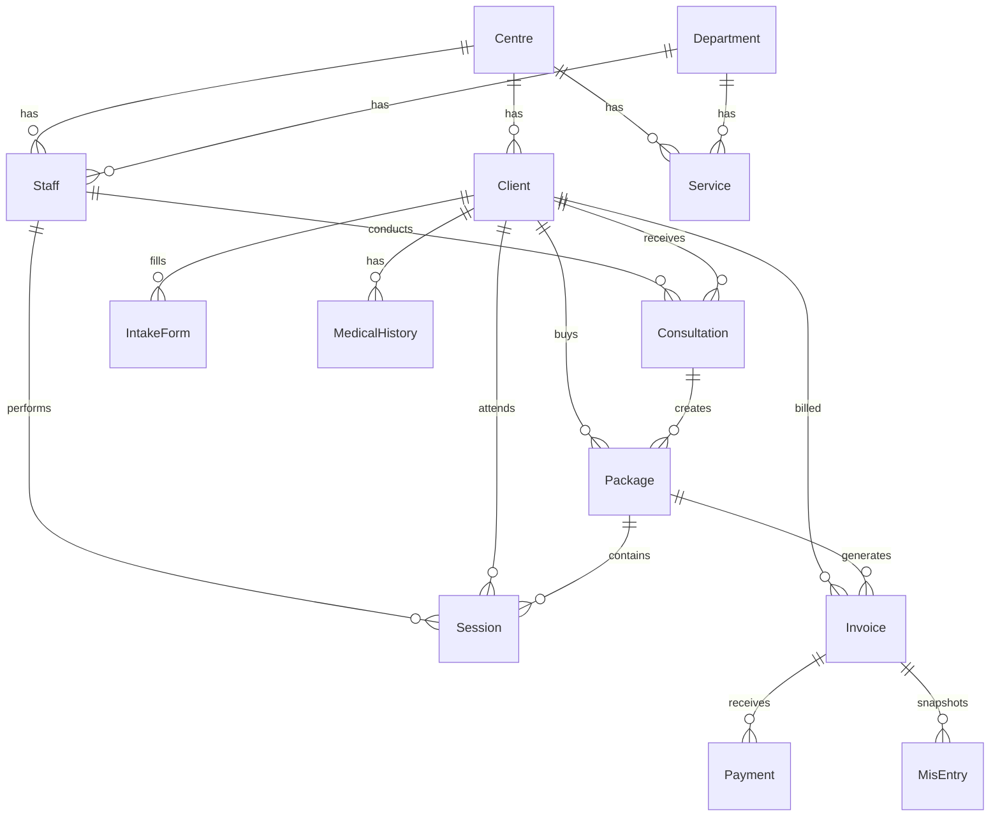

# Movement By Design (MBD) — Clinic OS Full Audit

> **Audit Date:** 27 May 2026 · **Status:** ✅ Running on `localhost:3000`

---

## 1. Project Purpose

**Movement By Design (MBD)** is a full-stack clinic management system for a physiotherapy/wellness centre in Mumbai. It manages the complete patient lifecycle:

```
QR Intake → FO Review → Consent PDF → Doctor Assignment → Consultation → Package → Sessions → Billing
```

~21 staff across 6 roles. Multi-centre support with centre-scoped data.

---

## 2. Technology Stack

| Layer | Technology | Version |
|-------|-----------|---------|
| Framework | Next.js (App Router, Turbopack) | 16.2.6 |
| Language | TypeScript | ^5 |
| UI | React | 19.2.3 |
| Styling | Tailwind CSS v4 + shadcn/ui (base-nova) | ^4 |
| DB | PostgreSQL via Supabase | — |
| ORM | Prisma | 6.19.2 |
| Auth | NextAuth v5 (beta) - Credentials + JWT | 5.0.0-beta.30 |
| Calendar | FullCalendar | 6.1.20 |
| PDF | jsPDF | 4.2.1 |
| Charts | Recharts | 2.15.4 |
| Validation | Zod | 4.3.6 |
| Icons | Lucide React | 0.577.0 |
| Cron | node-cron | 4.2.1 |
| Misc | bcryptjs, qrcode, signature_pad, uuid, sonner, date-fns |

### Dev Dependencies
`@tailwindcss/postcss`, `tsx` (script runner), `eslint`, `eslint-config-next`

---

## 3. Project Structure

```
clinic/
├── prisma/
│   ├── schema.prisma          # 664 lines, 24 models
│   ├── seed.ts                # 39KB seed script
│   └── supabase_seed.sql      # 225KB SQL seed
├── scripts/
│   ├── reset-and-seed.ts      # Full reset + seed
│   ├── backfill-mis.ts        # MIS backfill script
│   ├── backfill-slug.ts       # Centre slug backfill
│   ├── patch-owner-dev.ts     # Dev role patch
│   └── seed-sources.ts        # Referral source seeder
├── src/
│   ├── app/
│   │   ├── layout.tsx         # Root layout (Inter font, Providers, Toaster)
│   │   ├── page.tsx           # Auth redirect (→ /login or /dashboard)
│   │   ├── globals.css        # 403 lines — design system tokens
│   │   ├── login/             # Credentials login page
│   │   ├── intake/[token]/    # Public patient intake form
│   │   ├── portal/[token]/    # Public client portal share
│   │   ├── dashboard/         # 12 subdirectories, 44 pages
│   │   └── api/               # 29 endpoint directories, 49 route files
│   ├── components/
│   │   ├── ui/                # 55 shadcn components
│   │   ├── clinic-switcher.tsx
│   │   ├── global-search.tsx
│   │   ├── notification-center.tsx
│   │   ├── confirm-dialog.tsx
│   │   ├── signature-pad.tsx
│   │   └── providers.tsx
│   ├── hooks/
│   │   ├── use-api-cache.ts   # In-memory cache, 5min TTL
│   │   └── use-mobile.ts
│   ├── lib/                   # 19 utilities + pdf/ subdirectory
│   └── types/
│       └── next-auth.d.ts     # Session type augmentation
├── public/                    # SVGs + mbd-logo.png
├── .env / .env.local          # DB URLs, auth secret, Supabase keys
├── CLAUDE.md                  # AI coding instructions
├── STAFF_CREDENTIALS.md       # All staff logins
└── package.json               # "movement-by-design" v0.1.0
```

**Totals:** 196 source files, 1.53 MB of code

---

## 4. Database Schema (24 Models)



### Key Models

| Model | Purpose | Key Fields |
|-------|---------|-----------|
| **Centre** | Multi-clinic support | name, slug, location |
| **Staff** | Users/employees | email, role (string), passwordHash |
| **Client** | Patients | clientCode (MBD-0001), status (DRAFT→ACTIVE→INACTIVE) |
| **IntakeToken** | QR intake flow | token, status (PENDING→COMPLETED→EXPIRED) |
| **IntakeForm** | Patient forms | selectedServices, formData (JSON), consent flags |
| **MedicalHistory** | Vitals & history | vitals/comorbidities (JSON), diagnosis |
| **Consultation** | Doctor assessments | vitals, diagnosis, isLocked |
| **Package** | Session bundles | totalSessions, completedSessions, validUntil |
| **Session** | Treatment sessions | allotments (JSON), status |
| **Invoice** | Billing | lineItems (JSON), GST, discounts, promotions |
| **Payment** | Payment records | amount, method (CASH/CARD/UPI/etc) |
| **MisEntry** | MIS snapshots | Frozen invoice line data for reporting |
| **Appointment** | Calendar events | startTime, endTime, queuePosition |
| **AuditLog** | Change tracking | action, entity, changes (JSON diff) |
| **ClientDoctorAssignment** | Doctor-patient M:M | isPrimary, endedAt, replacedBy |
| **Notification** | In-app alerts | type, priority, targetUserId |
| **ChangeRequest** | Schedule/assign requests | RESCHEDULE/REASSIGN, PENDING→APPROVED |
| **Promotion** | Discount codes | discountType, maxDiscount, validUntil |
| **InventoryItem** | Equipment/supplies | stock, minStock, unitPrice |

> [!IMPORTANT]
> Many fields use **JSON strings** instead of proper relations: `Client.address`, `IntakeForm.formData`, `Consultation.vitals`, `Session.allotments`, `Invoice.lineItems`. Parse defensively.

---

## 5. Authentication & Authorization

### Auth Flow
- **NextAuth v5 beta** with Credentials provider + JWT strategy
- Login at `/login` → bcrypt password check → JWT token with extended fields
- Session extended with: `id`, `role`, `departmentId`, `departmentName`, `designation`
- Config: [auth.ts](file:///e:/WORK/GOATED/Medical/clinic%202/clinic/src/lib/auth.ts)

### RBAC System (6+1 Roles)

| Role | Scope | Users |
|------|-------|-------|
| **OWNER** | Full access (view-only clinical notes) | Marazban Doctor |
| **ADMIN** | Clinical + admin (no billing edit) | Dr. Yasir Zahid |
| **CONSULTANT** | Clinical only + change requests | Dr. Prerna |
| **THERAPIST** | Same as consultant | 15 therapists |
| **FRONT_OFFICE** | Ops: intake, scheduling, billing | 3 FO staff |
| **MANAGER** | Read-only management views | (unassigned) |
| **DEV** | All permissions (dev mode) | — |

**Permission system:** 38 granular permissions in [permissions.ts](file:///e:/WORK/GOATED/Medical/clinic%202/clinic/src/lib/permissions.ts)

Key functions: `hasPermission()`, `canAccessModule()`, `isClinicalRole()`, `isManagementRole()`

**Clinical access gate** in [clinical-access.ts](file:///e:/WORK/GOATED/Medical/clinic%202/clinic/src/lib/clinical-access.ts):
- OWNER/DEV: unrestricted
- THERAPIST/CONSULTANT: must be assigned to client, COMPLETED records are hard-locked
- Dashboard sidebar uses `ROLE_NAV_WHITELIST` to further restrict visible pages per role

### Default Credentials
All accounts: password `mbd2026`, emails follow `firstname@mbd.in`

---

## 6. Routing Map

### Public Routes
| Route | Purpose |
|-------|---------|
| `/login` | Staff login |
| `/intake/[token]` | Patient self-service intake (QR-scanned) |
| `/portal/[token]` | Client portal share link |

### Dashboard Routes (44 pages)

| Section | Route | Page |
|---------|-------|------|
| **Main** | `/dashboard` | Overview with stats, schedule, quick actions |
| **Patients** | `/dashboard/patients` | Patient directory with search/filter |
| | `/dashboard/patients/intake` | New patient intake |
| | `/dashboard/patients/assign` | Doctor/therapist assignment |
| | `/dashboard/patients/[id]` | Patient detail |
| | `/dashboard/patients/[id]/clinical-record` | Clinical record view |
| **Front Office** | `/dashboard/front-office/intake` | FO intake flow |
| | `/dashboard/front-office/assign` | FO assignment flow |
| | `/dashboard/front-office/clients` | FO client list |
| **Schedule** | `/dashboard/appointments/calendar` | FullCalendar week/day view |
| | `/dashboard/therapist/schedule` | Therapist-specific schedule |
| **Clinical** | `/dashboard/sessions` | Session management |
| | `/dashboard/sessions/consultations` | Consultation list |
| | `/dashboard/consultation` | Consultation form |
| | `/dashboard/therapist/sessions` | Therapist session view |
| | `/dashboard/clinical/counselling` | Counselling records |
| | `/dashboard/clinical/yoga` | Yoga records |
| | `/dashboard/clinical/fab` | FAB assessment (S&C) |
| **Billing** | `/dashboard/billing/invoices` | Invoice management |
| | `/dashboard/billing/payments` | Payment tracking |
| | `/dashboard/packages` | Package management |
| **Reports** | `/dashboard/reports` | Analytics & charts |
| | `/dashboard/reports/mis` | MIS report |
| | `/dashboard/reports/staff` | Staff performance |
| | `/dashboard/reports/defaulters` | Defaulter tracking |
| | `/dashboard/reports/sources` | Referral source analysis |
| **Admin** | `/dashboard/admin` | Admin console hub |
| | `/dashboard/admin/clinics` | Multi-clinic management |
| | `/dashboard/admin/hierarchy` | Org chart |
| | `/dashboard/admin/staff` | Staff CRUD |
| | `/dashboard/admin/services` | Service catalogue |
| | `/dashboard/admin/attendance` | Attendance logs |
| | `/dashboard/admin/audit` | Audit trail |
| | `/dashboard/admin/change-requests` | Request review |
| | `/dashboard/admin/flags` | Client flags |
| | `/dashboard/admin/inventory` | Inventory management |
| | `/dashboard/admin/promotions` | Promo codes |
| | `/dashboard/admin/referral-sources` | Referral sources |
| | `/dashboard/admin/mis` | MIS (admin path) |
| **Account** | `/dashboard/settings/profile` | User profile |

### API Routes (49 endpoints)

| Category | Endpoints |
|----------|-----------|
| **Auth** | `auth/[...nextauth]` |
| **Clients** | `clients/`, `clients/[id]`, `clients/[id]/assign-service`, `clients/[id]/handover` |
| **Staff** | `staff/`, `staff/[id]`, `staff/me/password`, `staff/me/signature` |
| **Clinical** | `consultations/`, `consultations/[id]`, `sessions/`, `sessions/[id]` |
| **Billing** | `invoices/`, `invoices/[id]`, `payments/`, `packages/`, `packages/[id]` |
| **Scheduling** | `appointments/`, `appointments/[id]` |
| **Admin** | `centres/`, `centres/[id]`, `departments/`, `services/`, `services/[id]`, `services/import` |
| **Intake** | `intake-token/`, `intake-token/[token]` |
| **Reports** | `dashboard/stats`, `reports/defaulters`, `reports/mis`, `reports/sources`, `reports/staff`, `mis/` |
| **Other** | `active-centre`, `attendance`, `audit`, `change-requests`, `client-portal/[token]`, `dashboard-share`, `flags`, `inventory`, `notifications`, `promotions/`, `promotions/[id]`, `referral-sources/`, `referral-sources/[id]`, `upload`, `cron/package-expiry` |

---

## 7. Key Pipelines

### Patient Intake Pipeline
```
1. FO generates IntakeToken (QR code)
2. Patient scans QR → /intake/[token]
3. Patient fills form (demographics, visit reasons, consent)
4. IntakeToken.status → COMPLETED, formData stored as JSON
5. FO reviews submission → creates Client record (status: DRAFT)
6. FO assigns doctor/therapist → ClientDoctorAssignment created
7. Client status → ACTIVE
```

### Clinical Pipeline
```
1. Consultant creates Consultation (vitals, diagnosis, plan)
2. Consultation → Package (session bundle with validity)
3. Therapist logs Sessions against Package
4. Package.completedSessions increments
5. Package status → COMPLETED when all sessions done
```

### Billing Pipeline
```
1. Invoice created with lineItems (JSON array)
2. GST calculated via billing.ts (CGST/SGST split)
3. Promotions applied as second-priority discount
4. MisEntry rows created (frozen snapshots for MIS)
5. Payments recorded → Invoice.paidAmount updated
6. MIS entries updated via applyPaymentToMisEntries()
```

### ID Generation
- Client codes: `MBD-0001`, `COL-MBD-0001` (centre-scoped)
- Invoice numbers: `MBD/001/2026` (yearly sequence)

> [!WARNING]
> Both use `findFirst(orderBy: desc)` — **concurrent inserts can collide**. No transactional locks.

---

## 8. Component Library

### 55 shadcn/ui Components
accordion, alert-dialog, alert, aspect-ratio, avatar, badge, breadcrumb, button-group, button, calendar, card, carousel, chart, checkbox, collapsible, combobox, command, context-menu, dialog, direction, drawer, dropdown-menu, empty, field, hover-card, input-group, input-otp, input, item, kbd, label, menubar, native-select, navigation-menu, pagination, popover, progress, radio-group, resizable, scroll-area, select, separator, sheet, sidebar, skeleton, slider, sonner, spinner, switch, table, tabs, textarea, toggle-group, toggle, tooltip

### Custom Components
| Component | Purpose |
|-----------|---------|
| `clinic-switcher.tsx` | Multi-centre dropdown in header |
| `global-search.tsx` | ⌘K command palette search |
| `notification-center.tsx` | Bell icon + notification panel |
| `confirm-dialog.tsx` | Reusable confirmation modal |
| `signature-pad.tsx` | Digital signature capture |
| `providers.tsx` | SessionProvider wrapper |
| `coming-soon.tsx` | Placeholder page |

---

## 9. Design System

The app uses a **Cal AI-inspired warm neumorphic** design:

- **Colors:** Warm peach/sage gradients (`#fdf6f4` → `#f5f5f5`), medical blue primary (`#2a7db8`)
- **Surfaces:** 3-layer system (surface, surface-secondary, surface-elevated)
- **Cards:** Neumorphic with layered box-shadows
- **Text:** 3-level hierarchy (primary `#1a1a1e`, secondary `#6b6b6b`, tertiary `#9a9a9a`)
- **Font:** Inter (Google Fonts)
- **Dark mode:** CSS vars defined but not actively used (hardcoded `class="light"`)
- **Animations:** shimmer loading, subtle-pulse for live indicators, press-scale, hover-lift

---

## 10. Live Screenshots

### Dashboard Overview (Therapist View)


### Admin Console


### Analytics & Reports


### Appointment Calendar


### Patient Directory


### Invoices


---

## 11. Environment & Build

### Environment Variables
| Variable | Source | Purpose |
|----------|--------|---------|
| `DATABASE_URL` | `.env` / `.env.local` | Supabase pooled connection (port 6543) |
| `DIRECT_URL` | `.env` / `.env.local` | Direct Postgres (port 5432, for Prisma) |
| `AUTH_SECRET` | `.env.local` | NextAuth JWT signing |
| `AUTH_TRUST_HOST` | `.env.local` | Trust host header (Vercel) |
| `NEXT_PUBLIC_SUPABASE_URL` | `.env.local` | Supabase Storage |
| `SUPABASE_SERVICE_ROLE_KEY` | `.env.local` | Storage admin client |

### NPM Scripts
| Command | Action |
|---------|--------|
| `npm run dev` | Dev server with Turbopack |
| `npm run build` | `prisma generate && next build` |
| `npm run db:push` | Push schema to Postgres |
| `npm run db:seed` | Run seed script |
| `npm run db:reset` | Force-reset DB + reseed |
| `npm run db:studio` | Open Prisma Studio |

### Build Status
- ✅ `prisma generate` — success
- ✅ `npm run dev` — running on `localhost:3000`
- ✅ Login works with seeded credentials
- ✅ All dashboard pages render correctly

---

## 12. Observations & Findings

### ✅ Strengths
1. **Comprehensive RBAC** — 38 permissions, role whitelists, clinical access gates
2. **Full audit trail** — AuditLog with auto-diff on mutations
3. **MIS reporting** — Frozen invoice snapshots for financial analytics
4. **Professional UI** — Cal AI-inspired design with neumorphic cards, warm gradients
5. **Smart caching** — `useApiCache` hook with 5min TTL, prefetch on layout mount
6. **PDF generation** — Consent forms, clinical records, intake summaries
7. **Multi-centre** — Centre-scoped data with slug-based ID prefixes
8. **Two-phase intake** — QR token → patient form → FO review → client creation

### ⚠️ Concerns

| Issue | Severity | Detail |
|-------|----------|--------|
| **No test suite** | 🔴 High | Zero tests configured — no unit, integration, or E2E |
| **No migrations** | 🟡 Medium | Uses `prisma db push` — no migration history |
| **ID race condition** | 🟡 Medium | `generateClientCode`/`generateInvoiceNumber` use `findFirst` — no locks |
| **JSON string fields** | 🟡 Medium | Address, vitals, lineItems stored as JSON strings, not proper relations |
| **Credentials in repo** | 🔴 High | `.env` and `.env.local` with real DB passwords + Supabase keys committed |
| **Dark mode incomplete** | 🟢 Low | CSS vars defined but HTML hardcoded to `class="light"` |
| **No rate limiting** | 🟡 Medium | API routes have no throttling |
| **No CSRF protection** | 🟡 Medium | Relies on NextAuth's built-in, no additional measures |
| **Beta auth library** | 🟡 Medium | NextAuth v5 is still beta (`5.0.0-beta.30`) |
| **`prisma` in dependencies** | 🟢 Low | Should be in devDependencies, not dependencies |
| **Dev SQLite DB** | 🟢 Low | `prisma/dev.db` exists but schema is Postgres-only |
| **No input sanitization** | 🟡 Medium | Zod validates shape but no HTML/XSS sanitization on freetext |

### 📋 Recommendations
1. **Add `.env` to `.gitignore`** — rotate all exposed credentials immediately
2. **Add E2E tests** — Playwright for critical flows (intake, billing, auth)
3. **Use DB transactions** for ID generation to prevent collisions
4. **Migrate to Prisma migrations** for production-safe schema changes
5. **Add rate limiting** middleware on sensitive API routes
6. **Move `prisma` to devDependencies**
7. **Delete `prisma/dev.db`** — unused SQLite artifact
8. **Consider upgrading NextAuth** when v5 reaches stable

---

## 13. Quick Reference

### Test Logins
| Role | Email | Password |
|------|-------|----------|
| Owner | `marazban@mbd.in` | `mbd2026` |
| Admin | `yasir@mbd.in` | `mbd2026` |
| Therapist | `devanshi@mbd.in` | `mbd2026` |
| Front Office | `ramchandra@mbd.in` | `mbd2026` |
| Consultant | `prerna@mbd.in` | `mbd2026` |

### Key File Locations
| File | Path |
|------|------|
| Prisma Schema | [schema.prisma](file:///e:/WORK/GOATED/Medical/clinic%202/clinic/prisma/schema.prisma) |
| Auth Config | [auth.ts](file:///e:/WORK/GOATED/Medical/clinic%202/clinic/src/lib/auth.ts) |
| Permissions | [permissions.ts](file:///e:/WORK/GOATED/Medical/clinic%202/clinic/src/lib/permissions.ts) |
| Dashboard Layout | [layout.tsx](file:///e:/WORK/GOATED/Medical/clinic%202/clinic/src/app/dashboard/layout.tsx) |
| Billing Logic | [billing.ts](file:///e:/WORK/GOATED/Medical/clinic%202/clinic/src/lib/billing.ts) |
| MIS Logic | [mis.ts](file:///e:/WORK/GOATED/Medical/clinic%202/clinic/src/lib/mis.ts) |
| API Cache Hook | [use-api-cache.ts](file:///e:/WORK/GOATED/Medical/clinic%202/clinic/src/hooks/use-api-cache.ts) |
| Validators | [validators.ts](file:///e:/WORK/GOATED/Medical/clinic%202/clinic/src/lib/validators.ts) |
| Design System | [globals.css](file:///e:/WORK/GOATED/Medical/clinic%202/clinic/src/app/globals.css) |
| Seed Script | [seed.ts](file:///e:/WORK/GOATED/Medical/clinic%202/clinic/prisma/seed.ts) |
